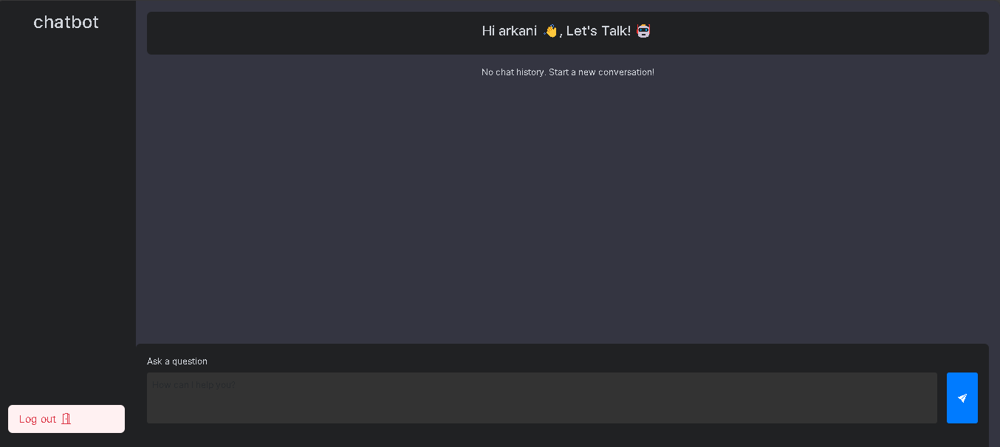
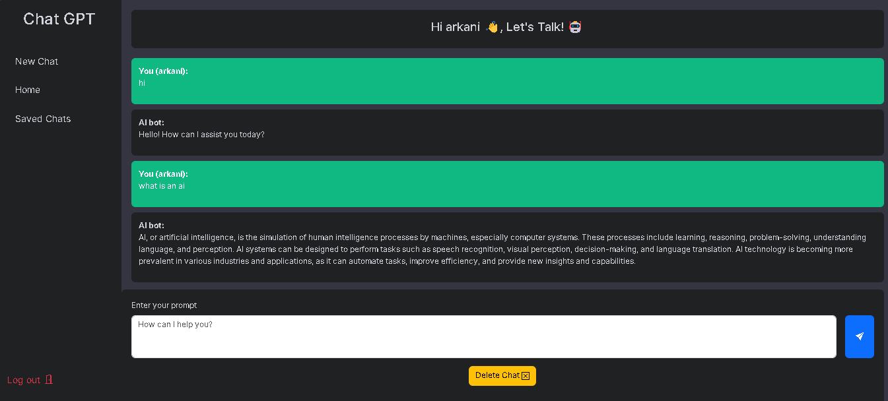

# Intelligent Chatbot with Django and OpenAI

Welcome to the Intelligent Chatbot project! This application is built using Django and OpenAI's language model to provide intelligent conversational capabilities.

## Features

- **Natural Language Processing**: Utilizes OpenAI's API for understanding and generating human-like responses.
- **Scalable Architecture**: Built with Django, a high-level Python web framework.
- **User-Friendly Interface**: Easy-to-use chat interface for seamless interaction.

## Installation

1. **Clone the repository**

    ```bash
    git clone https://github.com/Ruushy/Intelligent-Chatbot-in-django.git
    cd intelligent-chatbot-in-django
    ```

2. **Create a virtual environment**

    ```bash
    python -m venv venv
    source venv/bin/activate # On Windows use `venv\Scripts\activate`
    ```

3. **Install dependencies**

    ```bash
    pip install -r requirements.txt
    ```

4. **Set up environment variables**

    Create a `.env` file in the root directory and add your OpenAI API key:

    ```
    OPENAI_API_KEY=your_openai_api_key
    ```

5. **Run migrations**

    ```bash
    python manage.py migrate
    ```

6. **Start the server**

    ```bash
    python manage.py runserver
    ```

Access the application at `http://127.0.0.1:8000`.

## Usage

- Open your browser and navigate to `http://127.0.0.1:8000`.
- Start chatting with the bot right away!

## Screenshots


*the home page*


*The bot's response.*
